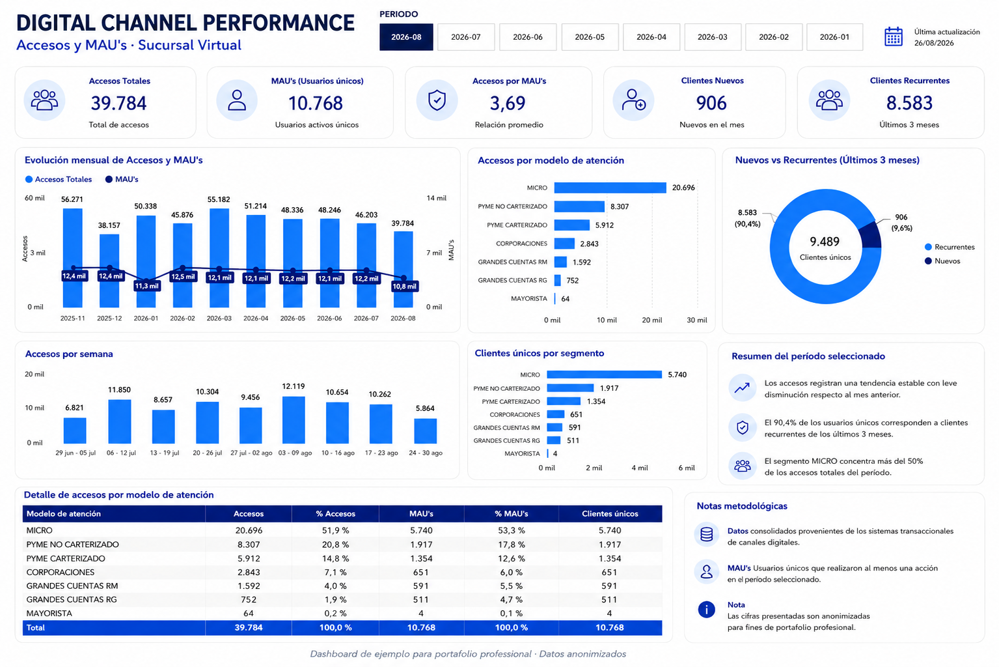

# 📊 Digital Channel Performance Dashboard

Case study de Business Intelligence basado en un proyecto profesional de analítica de canales digitales.

> 🔒 El dashboard fue reconstruido y anonimizado para fines de portafolio. No contiene logos corporativos, nombres de clientes, RUT, teléfonos ni información sensible.

## 🎯 Objetivo

Construir una vista ejecutiva que permita monitorear el desempeño de un canal digital a través de indicadores de uso, adopción y comportamiento de usuarios.

## 🧩 Problema

La información de accesos, usuarios y comportamiento se encontraba distribuida en distintas fuentes y necesitaba una lectura ejecutiva común para facilitar el seguimiento periódico.

## 💡 Solución

Diseñé un dashboard en Power BI que centraliza indicadores de actividad digital y permite analizar:

- Accesos totales.
- Usuarios únicos / MAUs.
- Relación accesos por MAU.
- Clientes nuevos.
- Clientes recurrentes.
- Evolución mensual.
- Evolución semanal.
- Distribución por segmento.
- Participación por modelo de atención.

## 🖼️ Dashboard preview

**Proyecto profesional · Visual anonimizado para portafolio**

## 📈 KPIs trabajados

`Accesos` `MAUs` `Accesos por MAU` `Clientes nuevos` `Clientes recurrentes` `Segmentación`

## 🧠 Decisiones de diseño

- Separación entre KPIs ejecutivos y análisis de detalle.
- Uso de tendencias temporales para identificar cambios de comportamiento.
- Comparación de accesos y usuarios únicos.
- Segmentación para entender concentración de uso.
- Resumen metodológico para facilitar lectura ejecutiva.
- Navegación orientada a periodos de análisis.

## 🛠️ Tecnologías

`Power BI` `DAX` `SQL Server` `Data Visualization` `KPI Design`

## 📐 Flujo analítico

`Fuentes de datos → Transformación → Modelo → DAX → Visualización → Insight`

## 📄 Medidas DAX

➡️ [dax-measures.md](./dax-measures.md)

## 🔐 Privacidad

La visualización publicada es una reconstrucción portfolio-safe. Los nombres, valores y elementos visuales fueron adaptados para proteger información confidencial y conservar únicamente el valor analítico del proyecto.

---

**Genesis Barreto**  
Data Analytics | Business Intelligence
