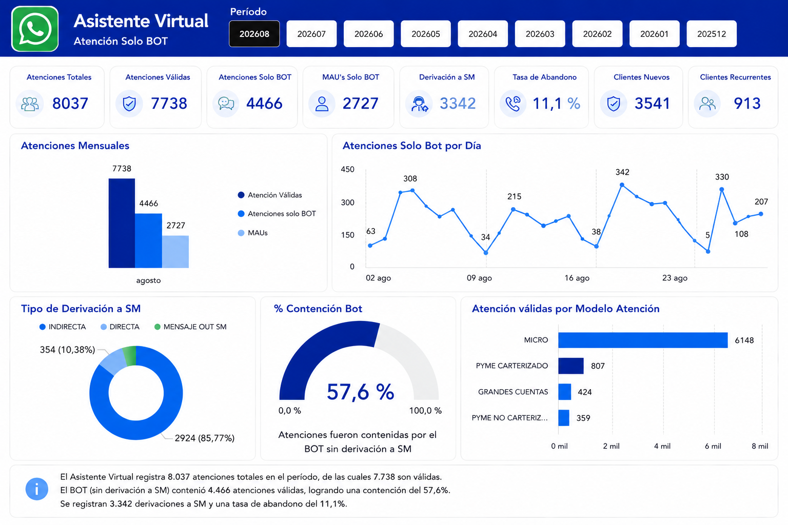

# 🤖 Virtual Assistant Analytics & Containment

Case study de Business Intelligence orientado al análisis de un asistente virtual, con foco en atención Solo BOT, contención, derivación y comportamiento de usuarios.

> 🔒 El dashboard fue reconstruido para portafolio manteniendo la lógica visual y los indicadores del proyecto original, pero sin utilizar identidad corporativa.

## 🎯 Objetivo

Monitorear el desempeño del asistente virtual y comprender qué proporción de las atenciones válidas es resuelta directamente por el BOT, cuántas requieren derivación y cómo evoluciona el comportamiento de los usuarios.

## 🧩 Problema

El seguimiento del canal requería una visión consolidada que permitiera analizar simultáneamente:

- Atenciones totales.
- Atenciones válidas.
- Atenciones Solo BOT.
- MAUs Solo BOT.
- Derivaciones a atención asistida.
- Tasa de abandono.
- Clientes nuevos.
- Clientes recurrentes.
- Contención del BOT.
- Comportamiento por modelo de atención.

## 💡 Solución

Diseñé un dashboard en Power BI que centraliza los principales indicadores del asistente virtual y permite analizar el comportamiento del canal por periodo, día, tipo de derivación y modelo de atención.

## 🖼️ Dashboard preview

**Proyecto profesional · Visual reconstruido para portafolio**

## 📊 KPIs trabajados

`Atenciones Totales` `Atenciones Válidas` `Atenciones Solo BOT` `MAUs Solo BOT` `Derivación a SM` `Tasa de Abandono` `Clientes Nuevos` `Clientes Recurrentes` `Contención Bot`

## 📈 Análisis desarrollados

### Atenciones mensuales

Comparación entre:

- Atenciones válidas.
- Atenciones Solo BOT.
- MAUs Solo BOT.

### Evolución diaria

Seguimiento del volumen diario de atenciones resueltas únicamente por el BOT.

### Tipo de derivación

Distribución de las derivaciones según el tipo de interacción.

### Contención BOT

Indicador utilizado para medir la proporción de atenciones válidas que fueron contenidas por el BOT sin derivación a atención asistida.

### Modelo de atención

Distribución de las atenciones válidas según el modelo de atención del cliente.

## 🧠 Lectura ejecutiva del periodo mostrado

Para el periodo representado en el dashboard:

- **8.037** atenciones totales.
- **7.738** atenciones válidas.
- **4.466** atenciones contenidas por el BOT sin derivación.
- **2.727** MAUs Solo BOT.
- **3.342** derivaciones a SM.
- **57,6 %** de contención BOT.
- **11,1 %** de tasa de abandono.
- **3.541** clientes nuevos.
- **913** clientes recurrentes.

## 🛠️ Tecnologías

`Power BI` `DAX` `SQL` `Conversational Analytics` `Customer Journey Analytics`

## 📐 Flujo analítico

`Interacciones → Validación → Clasificación → Contención / Derivación → Segmentación → Dashboard → Insight`

## 📄 Medidas DAX

➡️ [dax-measures.md](./dax-measures.md)

## 💼 Valor generado

- Centralización de indicadores del asistente virtual.
- Seguimiento periódico de contención y derivaciones.
- Identificación de comportamiento diario.
- Visibilidad de clientes nuevos y recurrentes.
- Comparación por modelo de atención.
- Apoyo al monitoreo de eficiencia del canal.

## 🔐 Privacidad

El visual publicado fue reconstruido para portafolio. Se eliminó la identidad corporativa y no se exponen credenciales, conexiones, datos personales ni información sensible de clientes.

---

**Genesis Barreto**  
Data Analytics | Business Intelligence
