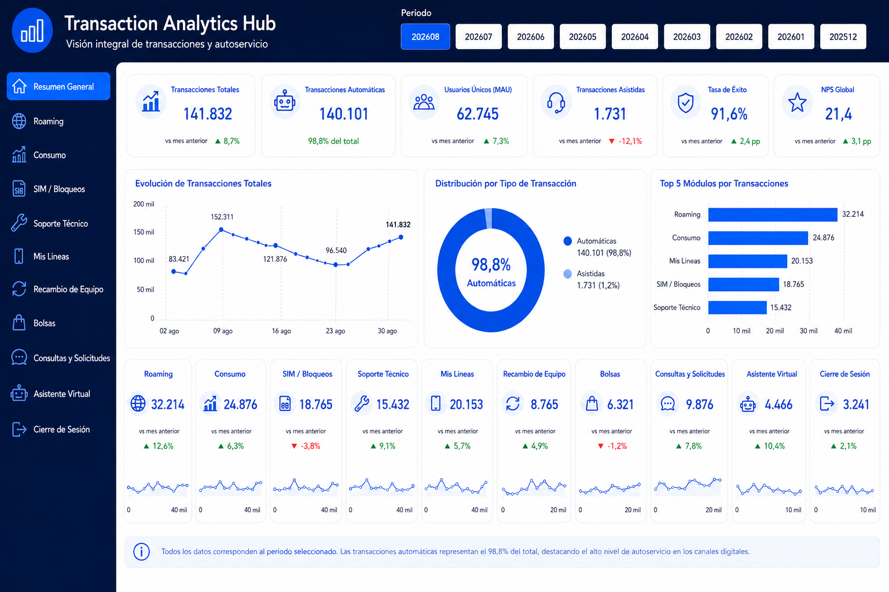

# 📊 Transaction Analytics Hub

Case study de Business Intelligence y Digital Analytics orientado a consolidar múltiples funcionalidades digitales dentro de un mismo producto analítico en Power BI.

> 🔒 El dashboard fue reconstruido para portafolio. Los valores visibles en el mockup son demostrativos y no corresponden a datos productivos ni a cifras empresariales reales.

## 🎯 Objetivo

Centralizar en un único hub analítico el seguimiento de distintos journeys digitales, manteniendo una lógica común de KPIs, navegación, segmentación y análisis temporal.

## 🧩 Problema

Las funcionalidades digitales se analizaban de forma separada, con estructuras y criterios distintos, dificultando la comparación entre dominios y el seguimiento ejecutivo.

## 💡 Solución

Diseñé un producto analítico en Power BI con navegación lateral por funcionalidad y una estructura reutilizable de indicadores, permitiendo analizar múltiples dominios desde una misma experiencia visual.

## 🖼️ Dashboard preview

**Proyecto profesional · Datos y visuales anonimizados para portafolio**

## 🧭 Dominios analizados

- Roaming.
- Detalle de deuda.
- Servicios de valor agregado.
- Consumo no facturado.
- Bloqueo y desbloqueo de SIM.
- Bloqueo y desbloqueo 809.
- Bolsas de datos.
- Líneas móviles.
- Renovación de equipos.
- Soporte técnico.
- Recambio de SIM.
- Consumo fijo.

## 📊 KPIs y análisis trabajados

- Accesos / transacciones totales.
- Usuarios únicos / MAUs.
- Promedio diario.
- Día de mayor transacción.
- Crecimiento mensual.
- Participación por funcionalidad.
- Participación por segmento.
- Activaciones y desactivaciones.
- Ingresos o montos asociados cuando corresponde.

## 🧠 Mi aporte

- Diseñé una estructura común de análisis reutilizable por funcionalidad.
- Organicé la navegación del producto BI por dominio.
- Construí medidas DAX transversales para mantener criterios consistentes.
- Integré vistas y fuentes de datos preparadas previamente en SQL.
- Validé los resultados con criterios de negocio antes de su publicación.
- Estandaricé la lectura ejecutiva de múltiples journeys digitales.

## 🛠️ Tecnologías

`Power BI` `DAX` `SQL Server` `Data Modeling` `Digital Analytics`

## 📐 Flujo analítico

`Fuentes de datos → Transformación SQL → Modelo analítico → DAX → Navegación por dominio → Insight`

## 📄 Medidas DAX

➡️ [dax-measures.md](./dax-measures.md)

## 💼 Valor generado

- Unificación del análisis de múltiples funcionalidades digitales.
- Estandarización de KPIs entre dominios.
- Reducción de duplicidad en lógica analítica.
- Mayor trazabilidad del comportamiento por funcionalidad.
- Lectura ejecutiva consistente para seguimiento y toma de decisiones.
- Capacidad de escalar el modelo incorporando nuevos journeys.

## 🔐 Privacidad

La visualización publicada es una reconstrucción portfolio-safe. No contiene logos corporativos, nombres reales de clientes, RUT, teléfonos, tickets, servidores, credenciales ni información sensible.

---

**Genesis Barreto**  
Data Analytics | Business Intelligence
