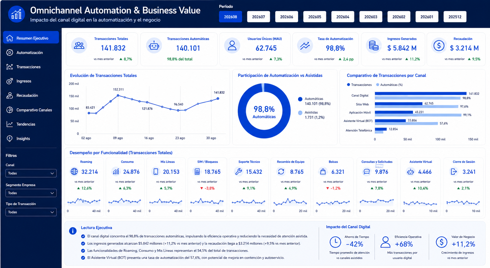

# 📈 Omnichannel Automation & Business Value

Case study de Business Analytics orientado a conectar el uso de canales digitales con automatización, eficiencia operativa y valor de negocio.

> 🔒 El dashboard fue reconstruido para portafolio. Los valores visibles en el mockup son demostrativos y no corresponden a cifras empresariales reales.

## 🎯 Objetivo

Construir una visión ejecutiva omnicanal que permita analizar el comportamiento de distintos canales digitales y relacionar su nivel de automatización con indicadores de eficiencia, ingresos y recaudación.

## 🧩 Problema

La actividad digital, la automatización y los indicadores de negocio se analizaban en capas separadas, dificultando entender el aporte de cada canal y comparar su desempeño de forma integrada.

## 💡 Solución

Diseñé una vista ejecutiva en Power BI que consolida información de distintos canales digitales y permite analizar:

- Volumen de transacciones.
- Usuarios únicos / MAUs.
- Participación de automatización.
- Comparación entre canales.
- Evolución temporal.
- Ingresos.
- Recaudación.
- Indicadores de eficiencia.

## 🖼️ Dashboard preview

**Proyecto profesional · Visual reconstruido y anonimizado para portafolio**

## 🌐 Canales representados

- Portal Web.
- Asistente Virtual.
- App.

## 📊 KPIs y análisis trabajados

- Transacciones totales.
- Transacciones automáticas.
- Usuarios únicos / MAUs.
- Tasa de automatización.
- Participación por canal.
- Ingresos.
- Recaudación.
- Comparación de desempeño omnicanal.
- Tendencia mensual.
- Desempeño por funcionalidad.

## 🧠 Mi aporte

- Consolidé una lectura omnicanal en una sola experiencia ejecutiva.
- Diseñé KPIs para relacionar actividad digital y automatización.
- Construí medidas DAX para seguimiento temporal y comparación entre canales.
- Integré indicadores de uso con variables de negocio.
- Organicé la visualización para facilitar lectura ejecutiva.
- Incorporé una capa de interpretación orientada a eficiencia y valor generado.

## 🛠️ Tecnologías

`Power BI` `DAX` `SQL Server` `Business Analytics` `Omnichannel Analytics`

## 📐 Flujo analítico

`Canales digitales → Transacciones → Automatización → Eficiencia → Ingresos / Recaudación → Insight`

## 📄 Medidas DAX

➡️ [dax-measures.md](./dax-measures.md)

## 💼 Valor generado

- Visión integrada del desempeño de canales digitales.
- Comparación consistente entre canales.
- Mayor trazabilidad sobre automatización.
- Relación entre uso digital e indicadores de negocio.
- Apoyo a decisiones sobre eficiencia y evolución de canales.
- Base analítica para identificar oportunidades de mejora.

## 🔐 Privacidad

La visualización publicada es una reconstrucción portfolio-safe. No contiene logos corporativos, nombres reales de clientes, RUT, teléfonos, tickets, servidores, credenciales ni información comercial confidencial.

---

**Genesis Barreto**  
Data Analytics | Business Intelligence

